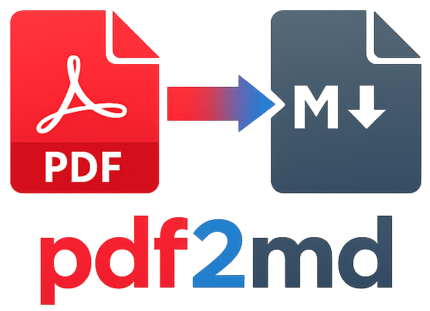

<div align="center">

<p align="center">
  
</p>

**Convert PDF files to Markdown using the [Mistral OCR](https://docs.mistral.ai/capabilities/document/) API.**

[](https://www.python.org/downloads/)
[](LICENSE)
[](https://github.com/psf/black)

</div>

---

## Features

| Feature | Description |
|---|---|
| **Text-only mode** *(default)* | Clean Markdown output — no images, no clutter. |
| **Image mode** (`--images`) | Extracts and saves all embedded images alongside the `.md` file. |
| **Global CLI** | Callable as `pdf2md` from anywhere after install. |
| **Right-click integration** | One-click conversion from Nautilus, Nemo, Dolphin & Thunar. |
| **`.env` support** | Keep your API key out of your shell history. |

---

## Quick Start

### 1. Install

```bash
# Clone the repository
git clone https://github.com/fchavelli/pdf2md.git
cd pdf2md

# Install (editable mode recommended for development)
pip install -e .

# — or install directly from the repo —
pip install git+https://github.com/fchavelli/pdf2md.git
```

### 2. Configure

```bash
cp .env.example .env
# Edit .env and paste your Mistral API key
```

You can obtain an API key from the [Mistral AI Console](https://console.mistral.ai/).

### 3. Convert

```bash
# Text-only (default)
pdf2md document.pdf

# With images
pdf2md --images document.pdf

# Custom output path
pdf2md document.pdf -o notes/output.md
```

---

## Installation

### From PyPI *(when published)*

```bash
pip install pdf2md
```

### From source

```bash
git clone https://github.com/fchavelli/pdf2md.git
cd pdf2md
pip install .
```

### Verify installation

```bash
pdf2md --version
```

---

## Usage

```
usage: pdf2md [-h] [-o OUTPUT] [-i] [-k API_KEY] [--env-file ENV_FILE] [-v] input

Convert PDF files to Markdown using Mistral OCR.

positional arguments:
  input                 Path to the input PDF file.

options:
  -h, --help            show this help message and exit
  -o, --output OUTPUT   Path for the output Markdown file (default: <input>.md).
  -i, --images          Include images extracted from the PDF.
  -k, --api-key KEY     Mistral API key (overrides env var / .env).
  --env-file ENV_FILE   Path to a .env file.
  -v, --version         show program's version number and exit
```

### Examples

```bash
# Basic conversion — produces report.md next to report.pdf
pdf2md report.pdf

# Extract with images — creates report_images/ directory
pdf2md --images report.pdf

# Specify output location
pdf2md report.pdf -o ~/Documents/report.md

# Use a specific .env file
pdf2md report.pdf --env-file /path/to/.env

# Pass API key inline (not recommended for security)
pdf2md report.pdf -k sk-xxxxxxxxxxxxx
```

### Using as a Python library

```python
from pdf2md.ocr import process_pdf

# Text-only
output = process_pdf("report.pdf")

# With images
output = process_pdf("report.pdf", include_images=True)

# Full control
output = process_pdf(
    "report.pdf",
    include_images=True,
    output_path="output/report.md",
    api_key="sk-...",
)
print(f"Markdown saved to {output}")
```

---

## Right-Click Context Menu

Install context-menu entries for your Linux file manager:

```bash
bash scripts/install-context-menu.sh
```

This adds entries for:

| File Manager | Method |
|---|---|
| **Nautilus** (GNOME Files) | Scripts menu → *PDF → Markdown* |
| **Nemo** (Cinnamon) | Right-click → *Convert PDF to Markdown* |
| **Dolphin** (KDE) | Right-click → *Convert PDF to Markdown* |
| **Thunar** (Xfce) | Manual custom action (instructions printed) |

To remove all entries:

```bash
bash scripts/uninstall-context-menu.sh
```

> **Note:** Restart your file manager after install/uninstall (`nautilus -q`, `nemo -q`, etc.).

---

## Configuration

### Environment Variables

| Variable | Required | Description |
|---|---|---|
| `MISTRAL_API_KEY` | ✅ | Your Mistral AI API key. |

The tool searches for a `.env` file in this order:

1. Path given via `--env-file`
2. Current working directory
3. Package installation directory

### API Key Security

- **Recommended:** Store the key in a `.env` file (already in `.gitignore`).
- **Alternative:** Export as an environment variable: `export MISTRAL_API_KEY=sk-...`
- **Avoid:** Passing the key via `-k` in shared environments (it may appear in process lists).

---

## Project Structure

```
pdf2md/
├── .env.example          # Template for environment variables
├── .gitignore
├── LICENSE               # MIT
├── README.md
├── pyproject.toml        # Package metadata & dependencies
├── pdf2md/
│   ├── __init__.py       # Version info
│   ├── cli.py            # Argument parsing & entry point
│   └── ocr.py            # Core OCR logic (Mistral API)
└── scripts/
    ├── install-context-menu.sh
    └── uninstall-context-menu.sh
```

---

## Requirements

- **Python** ≥ 3.9
- **Mistral AI API key** — [get one here](https://console.mistral.ai/)
- Internet connection (API calls)

Dependencies are installed automatically:

- [`mistralai`](https://pypi.org/project/mistralai/) — Mistral AI Python SDK
- [`python-dotenv`](https://pypi.org/project/python-dotenv/) — `.env` file support

---

## Troubleshooting

| Problem | Solution |
|---|---|
| `MISTRAL_API_KEY is not set` | Create a `.env` file or export the variable. |
| `pdf2md: command not found` | Make sure `pip install` completed and `~/.local/bin` is in your `PATH`. |
| Images not appearing | Use the `--images` flag. |
| Context menu not showing | Restart your file manager. |

---

## License

This project is licensed under the [MIT License](LICENSE).

---

## Contributing

Contributions are welcome! Please open an issue or submit a pull request.

1. Fork the repository
2. Create a feature branch (`git checkout -b feature/amazing`)
3. Commit your changes (`git commit -m 'Add amazing feature'`)
4. Push to the branch (`git push origin feature/amazing`)
5. Open a Pull Request
